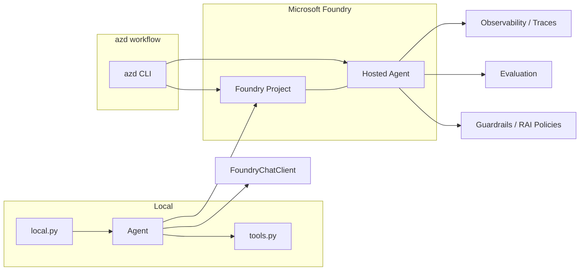

# Foundry Hosted Agent Demo

A demonstration of the end-to-end lifecycle of an AI agent built with the [Microsoft Agent Framework](https://aka.ms/agent-framework) and hosted on [Microsoft Foundry](https://learn.microsoft.com/en-us/azure/ai/foundry/) via the Azure Developer CLI (`azd`).

The agent bundled here — **HR Benefits Agent** — answers HR benefit questions (Health Insurance, Remote Work, Learning Budget). It serves as a concrete surface for showcasing every capability of the platform: local development, deployment, observability, evaluation, and guardrails.

---

## Table of Contents

- [Architecture](#architecture)
- [Prerequisites](#prerequisites)
- [Project Structure](#project-structure)
- [Getting Started](#getting-started)
- [Functionalities](#functionalities)
  - [Run the Agent Locally](#run-the-agent-locally)
  - [Deploy the Agent](#deploy-the-agent)
  - [Manage Sessions and Conversations](#manage-sessions-and-conversations)
  - [Update the Agent (System Prompt Iteration)](#update-the-agent-system-prompt-iteration)
  - [Observe Telemetry and Custom Traces](#observe-telemetry-and-custom-traces)
  - [Evaluate the Agent](#evaluate-the-agent)
  - [Apply Guardrails](#apply-guardrails)
  - [Query the Agent via REST API](#query-the-agent-via-rest-api)
  - [Explore Multiturn Conversations](#explore-multiturn-conversations)
- [Configuration Reference](#configuration-reference)
- [Troubleshooting](#troubleshooting)
- [Extending](#extending)

---

## Architecture



The same `agent.py` definition is used both for local execution and for the hosted deployment. When you run locally, the agent connects directly to Foundry's model endpoint. When you deploy, `azd` packages the code into a hosted agent that exposes a Responses API endpoint.

---

## Prerequisites

Things you need **before** following the steps in this README. Everything else is covered by the steps themselves (e.g., Python dependencies are installed with `uv sync`).

### Azure access and permissions

- An Azure subscription with access to Microsoft Foundry.
- **Roles** (this is the most common blocker — deploy fails with `AuthorizationFailed` without them):
  - If you use an **existing Foundry project**: `Foundry Project Manager` role **at project scope**.
  - If you need to **create a new Foundry project**: `Owner` role **at resource group scope**.
  - See the [hosted agent permissions reference](https://learn.microsoft.com/en-us/azure/foundry/agents/concepts/hosted-agent-permissions) for the full matrix.

### Tooling

| Tool | Version | Check | Install |
|---|---|---|---|
| Azure Developer CLI (`azd`) | ≥ 1.34.1 | `azd version` | `brew install azd` |
| `azd` extension `azure.ai.agents` | ≥ 1.0.0-beta.16 | `azd ext show azure.ai.agents` | `azd extension add azure.ai.agents` |
| `azd` extension `azure.ai.projects` | ≥ 1.0.0-beta.11 | `azd ext show azure.ai.projects` | `azd extension add azure.ai.projects` |
| Azure CLI (`az`) | latest | `az version` | `brew install azure-cli` |
| Python | ≥ 3.13 | `python --version` | [python.org](https://www.python.org/downloads/) |
| `uv` | latest | `uv --version` | `curl -LsSf https://astral.sh/uv/install.sh \| sh` |

The extension versions are enforced by `requiredVersions` in `azure.yaml` — `azd` will refuse to run if they are older.

### Azure resources that must already exist

This repo does **not** provision Azure infrastructure; it deploys an agent into an **existing Foundry project**. Before starting you need:

1. **A Foundry project** (created in the [Foundry portal](https://ai.azure.com)).
2. **A model deployment** in that project (e.g., `gpt-5.4-mini`, Standard SKU, with available quota).

If you don't have these, create them in the portal first — see [Getting Started](#getting-started) for what values to copy.

---

## Project Structure

```
foundry-hosted-agent-demo/
├── README.md
├── .env.example                     # Template for the local Python .env
├── azure.yaml                       # azd manifest (no guardrail; add policies: to attach one)
├── azure-with-guardrail.yaml        # azd manifest with an RAI policy placeholder
├── pyproject.toml                   # Project + dependency definition (used by uv)
├── uv.lock                          # Pinned dependency versions (used by uv sync)
├── test_multiturn.py                # Two-turn conversation via Azure AI Projects SDK
├── scripts/
│   └── generate_trace_traffic.sh    # Generates varied traffic for observability
└── src/
    └── foundry_hosted_agent_demo/
        ├── main.py                  # Entry point for the hosted agent
        ├── local.py                 # Local runner (single hardcoded query)
        ├── agent.py                 # Baseline agent definition
        ├── agent_mistake.py         # Intentionally broken prompt (for evaluation demos)
        ├── agent_new_version.py     # Updated system prompt ("Haahee!" closer)
        ├── tools.py                 # Benefit lookup tool (with custom span)
        ├── eval-improved.yaml       # Evaluation configuration
        ├── requirements.txt         # Pinned deps (used by the remote build)
        ├── .agentignore             # Files excluded from the deployment package
        ├── .agent_configs/
        │   └── baseline/
        │       ├── instructions.md  # Agent instructions snapshot (referenced by eval)
        │       └── metadata.yaml
        ├── datasets/
        │   └── hr-benefits-agent-improved/
        │       └── hr-benefits-agent_dg.jsonl
        └── evaluators/
            └── hr-benefits-agent/
                └── rubric_dimensions.json
```

> **Note:** `main.py` imports `create_agent` from `agent.py`. Swap that import to `agent_mistake` or `agent_new_version` for the demo scenarios described in [Update the Agent](#update-the-agent-system-prompt-iteration) and [Evaluate the Agent](#evaluate-the-agent).

---

## Getting Started

Follow these steps once, starting from zero.

### 1. Clone the repo and install Python dependencies

```bash
git clone <repo-url>
cd foundry-hosted-agent-demo
uv sync
```

`uv sync` creates `.venv/` and installs every Python dependency from `uv.lock` (including the `azure-ai-projects` SDK used by `test_multiturn.py` — the remote build during `azd deploy` installs its own copy on Azure's side from `requirements.txt`).

### 2. Create the Azure side (if you don't have it yet)

1. Open the [Foundry portal](https://ai.azure.com), create (or pick) a **Foundry project**.
2. In the project, deploy a chat-capable model (e.g., `gpt-5.4-mini`).
3. Copy two values:
   - **Project endpoint** (project **Overview** → "Project endpoint", e.g. `https://<account>.services.ai.azure.com/api/projects/<project>`)
   - **Deployment name** (e.g., `gpt-5.4-mini`)

### 3. Authenticate

`azd` and `az` keep **separate sessions** — log in to both:

```bash
azd auth login
az login
```

### 4. Configure the two environment layers

There are **two independent configurations** — missing either one is the most common cause of getting stuck:

**Layer 1 — the azd environment (used by `azd deploy`, `azd ai agent ...`):**

```bash
azd env new my-demo-env
azd env set FOUNDRY_PROJECT_ENDPOINT "https://<account>.services.ai.azure.com/api/projects/<project>"
azd env set AZURE_AI_MODEL_DEPLOYMENT_NAME "gpt-5.4-mini"
```

Verify with `azd env get-values`. These values are substituted into `azure.yaml` (`${FOUNDRY_PROJECT_ENDPOINT}`, `${AZURE_AI_MODEL_DEPLOYMENT_NAME}`) at deploy time.

**Layer 2 — the root `.env` (used by local Python runs: `local.py`, `test_multiturn.py`):**

```bash
cp .env.example .env
# then edit .env with the same two values
```

The agent code itself (`agent.py`) reads these via `load_dotenv()`; the azd environment does not populate it.

### 5. Sanity-check your setup

```bash
azd ai agent doctor
```

This validates local config, authentication, the Foundry project endpoint, that **you hold the required role on the project**, and that hosted agents are enabled. Fix anything it reports before continuing — it is much faster than debugging a failed deploy.

### 6. Make sure the model deployment is reachable

Verify the model deployment you set in `AZURE_AI_MODEL_DEPLOYMENT_NAME` actually exists in the project (`Build → Deployments` in the portal). A wrong name surfaces later as `DeploymentNotFound` on invocation — not at deploy time.

---

## Functionalities

### Run the Agent Locally

Before deploying, you can run and test the agent locally using the same code and model client that the hosted version will use.

**Option A — Run the azd local server:**

```bash
azd ai agent run
```

This installs dependencies, launches the agent via `main.py` (starting a `ResponsesHostServer`), and opens an interactive local session. Run this first if you plan to use `azd ai agent invoke --local`, since `--local` targets the server started by this command.

**Option B — Invoke with a specific prompt (local):**

```bash
azd ai agent invoke --local "Who is eligible for the Learning Budget?"
azd ai agent invoke --local "Tell me about the Remote Work benefit."
```

Requires the local server from Option A to be running in another terminal. The `--local` flag routes the request to the local agent instance instead of the deployed one. The agent is already using the same contract (Responses API, tool definitions) that it will use when hosted — so what works locally works in the cloud with no changes.

**Option C — Quick smoke test script:**

```bash
python src/foundry_hosted_agent_demo/local.py
```

This instantiates the agent via `create_agent()` and runs a single hard-coded query. Useful for the quickest possible check that credentials and the model endpoint work (uses the root `.env`).

---

### Deploy the Agent

Once you're satisfied with the local behavior, deploy the agent to Foundry so it runs as a managed service.

```bash
azd deploy
```

`azd` reads `azure.yaml`, packages `src/foundry_hosted_agent_demo/` (excluding files in `.agentignore`, like `.env`), and deploys it as a hosted agent. Dependencies are resolved with a **remote build** from `requirements.txt`. When deployment finishes, the output shows the agent playground URL and endpoint.

**Verify the deployment:**

```bash
azd ai agent show hr-benefits-agent
```

This displays the agent's metadata — status, **version**, playground URL, and the endpoint URLs. Each deployment creates a new version; `show` is where you confirm which one is active.

**Inspect resolved environment values:**

```bash
azd env get-values
```

This shows what `azd` will substitute into `azure.yaml` — check here if a `${...}` placeholder failed to resolve.

**Invoke the deployed agent:**

```bash
azd ai agent invoke "Who is eligible for the Learning Budget?"
```

Without `--local`, the request goes to the hosted agent in Foundry.

---

### Manage Sessions and Conversations

Foundry distinguishes two concepts that are easy to conflate:

> **Session** — the execution environment for the agent (resources, configuration, state context).
> **Conversation** — the message history within a session.

By default, `azd ai agent invoke` reuses the last session. This means subsequent invocations share context, allowing the agent to reference prior messages:

```bash
azd ai agent invoke "Tell me about the Remote Work benefit."
azd ai agent invoke "What benefit did I just ask about?"
# ↑ The agent knows you asked about Remote Work in the previous turn
```

To start a **new session** — breaking the conversation continuity:

```bash
azd ai agent invoke --new-session "What benefit did I just ask about?"
# ↑ The agent has no prior context and won't be able to answer
```

After a session change or import from the Conversations Playground in the portal, the latest session is marked "active" automatically.

---

### Update the Agent (System Prompt Iteration)

A core benefit of the hosted model is iterative improvement. You can change the agent's system prompt, redeploy, and observe the difference immediately.

The repo includes `agent_new_version.py`, which adds a closing phrase to the instructions:

```python
# agent.py (baseline)
"Do not invent benefit information. "

# agent_new_version.py (updated)
"Do not invent benefit information. "
"Close always with saying Haahee!"
```

**To apply the update:**

1. Replace the import in `main.py`:

   ```python
   # from agent import create_agent        ← baseline
   from agent_new_version import create_agent
   ```

2. Redeploy:

   ```bash
   azd deploy
   ```

3. Verify the new behavior:

   ```bash
   azd ai agent invoke "Tell me about the Learning Budget."
   # The response now ends with "Haahee!"
   ```

4. Confirm the new version with `azd ai agent show hr-benefits-agent` — you'll see the version number increase.

To revert, restore the original import in `main.py` and deploy again.

---

### Observe Telemetry and Custom Traces

Foundry provides built-in observability through the Monitoring / Traces views. Every agent invocation produces traces that show tool calls, model latencies, and the full request/response pipeline.

> **Prerequisite for traces in the portal:** the Foundry project must have **monitoring enabled** (an Application Insights resource connected to the project). This is configured at project creation or in the project's settings in the portal. If your project was created without it, the Monitoring tab will simply show no data — **there is no error message telling you why**. The custom spans below land in the same pipeline, so they will also be invisible without it.

**View live logs:**

```bash
azd ai agent monitor --follow
```

This streams container logs (stdout/stderr) and system events from the agent session. A session ID is required — `azd` auto-resolves it from the **last invocation**, so invoke the agent at least once before monitoring:

```bash
azd ai agent invoke "Tell me about the Remote Work benefit."   # creates a session
azd ai agent monitor --follow                                  # now this works
```

You can also pass one explicitly: `azd ai agent monitor --session-id <SESSION_ID> --follow`. For the visual experience, open the **Monitoring** tab of your agent in the Foundry portal (traces may take a few minutes to appear).

**Generate traffic for tracing:**

```bash
./scripts/generate_trace_traffic.sh
```

This script runs a series of prompts against the deployed agent — single queries, unsupported benefits, cross-benefit comparisons, multi-turn conversations, and a new-session contrast — to generate rich and varied trace data.

**Add custom spans to your code:**

`tools.py` already includes a custom trace span. The key code:

```python
from agent_framework.observability import get_tracer

tracer = get_tracer()

@tool
def get_benefit_details(benefit_name: ...):
    with tracer.start_as_current_span("benefit.lookup") as span:
        span.set_attribute("benefit.name", benefit_name)
        # ... tool logic ...
```

This creates a custom span named `benefit.lookup` with a `benefit.name` attribute visible alongside the platform-generated spans in the trace timeline. After redeploying with custom tracing code:

```bash
azd deploy
azd ai agent invoke "Tell me about the Remote Work benefit."
```

Look for the `benefit.lookup` span in the trace viewer — clearly distinguishing your own instrumentation from platform telemetry.

---

### Evaluate the Agent

Foundry's evaluation framework lets you generate a test dataset, define rubrics, and score agent responses automatically.

**Generate a test dataset (optional — the repo ships one):**

```bash
azd ai agent eval generate \
  --gen-instruction "Test this HR benefits agent for accurate benefit answers, appropriate tool use, and handling unsupported benefits." \
  --eval-model gpt-5.4-mini \
  --max-samples 15 \
  --out-file eval-demo.yaml
```

This generates a dataset of prompts using an evaluator model. The repo also includes a curated dataset at `datasets/hr-benefits-agent-improved/hr-benefits-agent_dg.jsonl` with 15 test cases covering supported benefits, eligibility queries, unsupported benefit handling, and mixed queries.

**Run an evaluation:**

```bash
azd ai agent eval update --config eval-improved.yaml
azd ai agent eval run --config eval-improved.yaml
```

- `eval update` uploads your **local** dataset and rubric files to Foundry (the version numbers in `eval-improved.yaml` are bumped on success).
- `eval run` executes the evaluation and reports scores.

Run `eval update` first whenever you change files under `datasets/` or `evaluators/` — otherwise the run evaluates stale data.

The evaluation config references the rubric dimensions defined in `evaluators/hr-benefits-agent/rubric_dimensions.json`:

| Dimension | Weight | What it checks |
|---|---|---|
| `tool_use_for_exact_policy_details` | 10 | Does the agent use `get_benefit_details` for policy queries? |
| `scope_conformance` | 6 | Does the response stay within supported benefits? |
| `grounded_policy_answer` | 6 | Are answers consistent with tool output (no invented facts)? |
| `unsupported_benefit_handling` | 5 | Does the agent clearly say when a benefit is unavailable? |
| `uncertainty_and_gap_signaling` | 4 | Does the agent acknowledge info gaps instead of guessing? |
| `cross_benefit_boundaries` | 3 | For mixed queries, is supported info separated from unsupported? |
| `general_quality` | 5 | Overall quality factors. |

**Evaluate a broken agent to see failures:**

The repo includes `agent_mistake.py`, whose system prompt instructs the agent _not_ to use the `get_benefit_details` tool:

```python
# agent_mistake.py
"Do not use get_benefit_details tool."
```

To see how evaluation surfaces this regression:

1. Swap the import in `main.py`:

   ```python
   from agent_mistake import create_agent
   ```

2. Redeploy and run the evaluation:

   ```bash
   azd deploy
   azd ai agent eval run --config eval-improved.yaml
   ```

3. The evaluation reports low scores on `tool_use_for_exact_policy_details` and `grounded_policy_answer` — clearly identifying that the agent is ignoring the tool. Check the failed cases in the portal (Traces view) to see the agent improvising instead of calling the tool.

4. Restore the baseline (`from agent import create_agent`) and redeploy.

---

### Apply Guardrails

Foundry supports Responsible AI (RAI) policies that are enforced at inference time. By default, `azure.yaml` ships **without a `policies:` block** — the platform applies its own baseline content-safety behavior, but you attach explicit guardrails by referencing an RAI policy in the manifest.

**You must create your own policy** — the resource ID is tied to your subscription and cannot be shipped in the repo:

1. In the [Foundry portal](https://ai.azure.com), open your Foundry account → **Content safety / RAI policies**, and create a policy (e.g., with PII detection filters).

   > Creating and managing RAI policies requires appropriate permissions on the Foundry account (for example, **Azure AI Developer** or above at the account/resource-group scope).

2. Copy the policy's **full resource ID** (ARM ID).
3. Reference it in the manifest — `azure-with-guardrail.yaml` shows the pattern with a placeholder:

   ```yaml
   policies:
       - type: rai_policy
         raiPolicyName: /subscriptions/<subscription-id>/resourceGroups/<resource-group>/providers/Microsoft.CognitiveServices/accounts/<foundry-account>/raiPolicies/<your-policy-name>
   ```

4. Copy it into `azure.yaml` (or deploy from the guardrail manifest), then deploy:

   ```bash
   cp azure-with-guardrail.yaml azure.yaml
   azd deploy
   ```

**Test the guardrail:**

Send a prompt that should be refused by the content safety policy — for example, a request asking how to harm someone:

```bash
azd ai agent invoke "<prompt that violates the policy>"
```

A hardened agent should refuse. If the policy blocks the request at input stage, the invoke returns an HTTP `400` with a `content_safety_error` body like:

```json
{
  "error": {
    "code": "content_filter",
    "message": "The request was blocked due to content safety policy violation at input stage. [Request ID: ...]",
    "type": "content_safety_error"
  }
}
```

> **Caution — tune your policy before relying on it:** a strictly configured custom policy can reject even benign inputs. During the demo this exact repo ran with a PII policy so strict that **every** request — including `"Hello"` — was blocked at the input stage with the error above. If all invocations suddenly fail after attaching a policy, check the policy thresholds.

To remove the guardrail, delete the `policies:` block from `azure.yaml` and redeploy.

---

### Query the Agent via REST API

The deployed agent exposes an **OpenAI-compatible Responses API** endpoint. Any HTTP client can call it with a bearer token — no SDK required.

**1. Get the endpoint URL:**

```bash
azd ai agent show hr-benefits-agent
```

Copy the `Endpoint (responses)` field:

```
https://<account>.services.ai.azure.com/api/projects/<project>/agents/<agent>/endpoint/protocols/openai/responses?api-version=v1
```

**2. Get a token** (the `az` CLI makes this easy):

```bash
TOKEN=$(az account get-access-token --resource https://ai.azure.com --query accessToken -o tsv)
```

**3. POST a request:**

```bash
curl -s -X POST \
  "https://<account>.services.ai.azure.com/api/projects/<project>/agents/hr-benefits-agent/endpoint/protocols/openai/responses?api-version=v1" \
  -H "Authorization: Bearer $TOKEN" \
  -H "Content-Type: application/json" \
  -d '{"input": "Tell me about the Remote Work benefit."}'
```

The response body is Responses-API shaped. Two fields are especially useful:

- `output_text` — the agent's final text answer.
- `agent_session_id` (returned by the API) — the session the invocation ran in; reuse it to continue the conversation (this is exactly what `test_multiturn.py` does via the SDK).

**Multi-turn over REST:** pass `previous_response_id: "<response id>"` from turn 1 in the next request's body to chain turns, mirroring the SDK example in [Explore Multiturn Conversations](#explore-multiturn-conversations).

> If you get a `401`, your token expired — re-run step 2. If you get the `content_filter` error from the [guardrails section](#apply-guardrails), your attached policy is rejecting the input.

---

### Explore Multiturn Conversations

Beyond the `azd` CLI and raw REST, you can interact with the deployed agent programmatically using the **Azure AI Projects SDK**. The `test_multiturn.py` script demonstrates a two-turn conversation where the second turn depends on the first:

```bash
python test_multiturn.py
```

This script (uses the root `.env`):
1. Sends a message stating a name (`"Mi nombre es Christian."`)
2. Captures the `agent_session_id` from the response
3. Sends a follow-up question (`"¿Cómo me llamo?"`) with `previous_response_id` and `extra_body={"agent_session_id": session_id}` to chain the turns

This provides full control over session and conversation management from code — useful when building chat applications or running integration tests.

---

## Configuration Reference

### Environment Variables

| Variable | Used by | Description |
|---|---|---|
| `FOUNDRY_PROJECT_ENDPOINT` | azd env + `.env` | Foundry project endpoint URL |
| `AZURE_AI_MODEL_DEPLOYMENT_NAME` | azd env + `.env` | Deployment name of the model to use |

Remember: the **azd environment** covers deploy/invoke; the root **`.env`** covers the local Python scripts. Both need the same values.

### azd Manifest (`azure.yaml`)

| Field | Description |
|---|---|
| `requiredVersions` | Minimum azd + extension versions (enforced) |
| `services.ai-project` | Foundry project integration (endpoint from env) |
| `services.hr-benefits-agent` | The hosted agent service |
| `codeConfiguration.entryPoint` / `.runtime` | `main.py` / `python_3_13` |
| `codeConfiguration.dependencyResolution` | `remote_build` — deps resolved on Azure's side from `requirements.txt` |
| `policies` | *(optional)* RAI policy attached at inference time — see [Guardrails](#apply-guardrails) |
| `protocols` | `responses` v2.0.0 — the exposed API contract |

### Agent Variants

| File | Purpose | System Prompt Difference |
|---|---|---|
| `agent.py` | Baseline | Standard instructions |
| `agent_mistake.py` | For evaluation regression demos | Tells agent _not_ to use the tool |
| `agent_new_version.py` | Demonstrates prompt iteration | Adds "Close always with saying Haahee!" |

**To switch between agent versions:** edit the import in `main.py` to point to the desired module, then `azd deploy`.

### Evaluation Configuration (`eval-improved.yaml`)

| Field | Description |
|---|---|
| `agent.version` | Agent version to evaluate (bumped by each deploy) |
| `dataset.local_uri` | Path to the JSONL test dataset |
| `evaluators[].local_uri` | Path to the rubric dimensions JSON |
| `options.eval_model` | Model used for evaluating responses |
| `max_samples` | Maximum dataset samples to evaluate |
| `trace_days` | Days of traces to include |

---

## Troubleshooting

| Symptom | Likely cause | Fix |
|---|---|---|
| `AuthorizationFailed` during deploy | Missing Azure role | Existing project: `Foundry Project Manager` at project scope. New project: `Owner` at resource-group scope. |
| `azd` refuses to start, complains about versions | Old `azd` or extensions | `azd version`; `azd extension add azure.ai.agents`; `azd extension add azure.ai.projects` |
| `AuthenticationError` / `DefaultAzureCredential` failure | azd/az session expired | `azd auth logout && azd auth login`; also `az login` (separate sessions!) |
| `ResourceNotFound` / `DeploymentNotFound` on invoke | Wrong project endpoint or model deployment name | Verify in the portal (Overview / Build → Deployments); check `azd env get-values` and `.env` |
| Local Python run: `KeyError: 'FOUNDRY_PROJECT_ENDPOINT'` | Root `.env` missing | `cp .env.example .env` and fill it in — the azd environment does not feed local scripts |
| `azd deploy` outputs unresolved `${...}` placeholders | Variable missing from azd env | `azd env set FOUNDRY_PROJECT_ENDPOINT ...` etc., then re-deploy |
| Monitoring tab in portal shows nothing | Project has no App Insights connected | Enable monitoring for the project in the portal; traces take a few minutes to appear |
| `azd ai agent monitor` has no session | No prior invocation | `azd ai agent invoke "..."` first, or pass `--session-id` |
| All invocations fail with `content_filter` errors | Attached RAI policy too strict | Adjust policy thresholds in the portal, or remove `policies:` from `azure.yaml` and redeploy |
| Everything looks right, still stuck | — | Run `azd ai agent doctor` — it validates local config, auth, project, roles, and hosted agents |
| `SubscriptionNotRegistered` | Provider not registered | `az provider register --namespace Microsoft.CognitiveServices` |
| Model deployment fails / no quota | Quota exhausted in region | Pick a different region or SKU, or request quota |

---

## Extending

This project is designed to be extended with additional agents, tools, and demonstration scenarios. To add a new agent:

1. **Create agent definition** — add a new `agent_[name].py` (or reuse the pattern from `agent.py`) under `src/foundry_hosted_agent_demo/`.
2. **Add tools** — define new tools in `tools.py` (or a separate module) using the `@tool` decorator from `agent_framework`. Use `get_tracer()` spans for custom tracing.
3. **Add a service** — add a new entry under `services:` in `azure.yaml`:

   ```yaml
   my-new-agent:
       project: src/foundry_hosted_agent_demo
       host: azure.ai.agent
       language: python
       uses:
           - ai-project
       kind: hosted
       name: my-new-agent
       codeConfiguration:
           dependencyResolution: remote_build
           entryPoint: main_my_new_agent.py
           runtime: python_3_13
       protocols:
           - protocol: responses
             version: 2.0.0
       env:
           AZURE_AI_MODEL_DEPLOYMENT_NAME: ${AZURE_AI_MODEL_DEPLOYMENT_NAME}
   ```

4. **Add evaluation data** — create a `datasets/` entry and an `evaluators/` rubric for the new agent, plus an eval config YAML.
5. **Deploy and iterate** — use the same `azd deploy` / `azd ai agent invoke` / `azd ai agent monitor` / `azd ai agent eval run` workflow.

The project structure and configuration patterns scale naturally — each agent is just another service definition and Python module pair with its own evaluation dataset and rubric.
